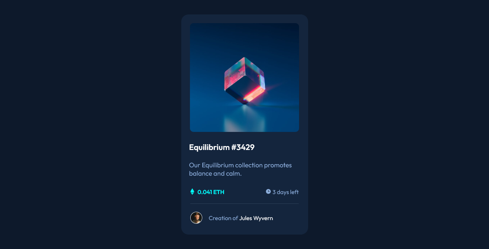

# Frontend Mentor - NFT preview card component solution

This is a solution to the [NFT preview card component challenge on Frontend Mentor](https://www.frontendmentor.io/challenges/nft-preview-card-component-SbdUL_w0U). Frontend Mentor challenges help you improve your coding skills by building realistic projects.

## Table of contents

- [Overview](#overview)

  - [The challenge](#the-challenge)
  - [Screenshot](#screenshot)
  - [Links](#links)

  - [Built with](#built-with)
  - [What I learned](#what-i-learned)
  - [Continued development](#continued-development)
  - [Useful resources](#useful-resources)

- [Author](#author)

## Overview

### The challenge

Users should be able to:

- View the optimal layout depending on their device's screen size
- See hover states for interactive elements

### Screenshot



### Links

- Live Site URL: [Add live site URL here](https://rennermedeirosnft-preview-card.netlify.app/)

### Built with

- HTML
- CSS custom properties
- SVG animation
- Flexbox

### What I learned

a little of animation with svg
i edited the svg image on figma and added a stroke, so i used the edited file instead of the original file

this is the code of the animation:

```css
.card__img:hover .card__hover-container-icon {
	opacity: 1;
	z-index: 1;
	animation: hover-svg-animation 5s ease-in-out alternate infinite;
}

@keyframes hover-svg-animation {
	0% {
		stroke-width: 0;
		stroke-dasharray: 0 100;
		fill: transparent;
	}
	25% {
		stroke-width: 3%;
		stroke-dasharray: 100 0;
		fill: transparent;
	}
	60%,
	100% {
		stroke-width: 0.3;
		fill: #fff;
	}
}
```

## Author

- Frontend Mentor - [@RennerMedeiros](https://www.frontendmentor.io/profile/RennerMedeiros)
- Github [RennerMedeiros](https://github.com/RennerMedeiros)
